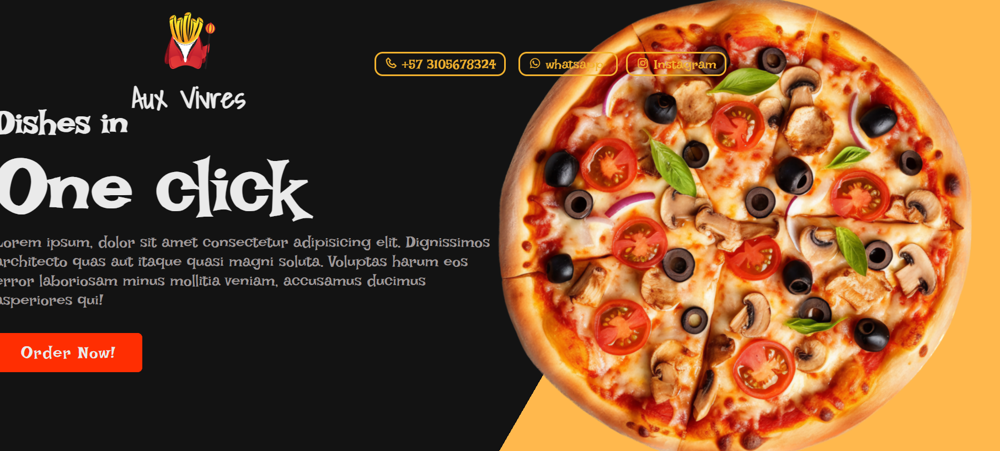

# Pizzeria Order Page 🍕

## Description

This repository contains the code for a web page designed for a pizzeria to take new orders. The project is built using HTML, CSS, and JavaScript, featuring CSS animations to enhance the user experience and make the ordering process enjoyable and interactive.

## Features

- **Order Creation**: Users can create new pizza orders with customizable options.
- **Smooth Animations**: Utilizes CSS animations to enhance the visual appeal.
- **Interactive Interface**: Real-time updates and interactive elements for a seamless ordering experience.
- **User-friendly Design**: Clean and intuitive design for easy navigation and use.
- **Responsive Design**: Optimized for various screen sizes, ensuring a smooth experience on both desktop and mobile devices.
